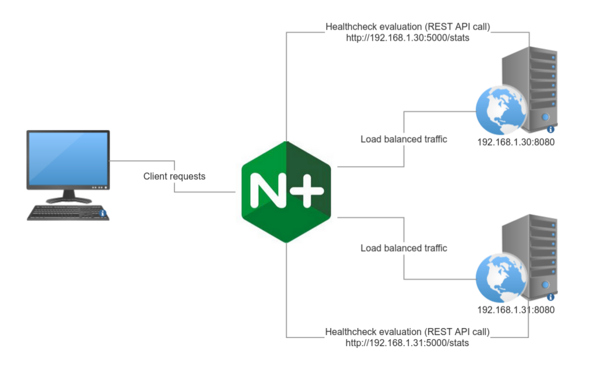

# NGINX Advanced Healthcheck

## Description

This repository provides a sample NGINX Plus configuration to support advanced active healthchecks.

Upstream servers availability status is dynamically set based on evaluation of external REST API that can provide any type of JSON reply.
JSON responses can be evaluated by custom logic by adapting the sample [`healthcheck.js`](nginx/conf.d/healthcheck.js) configuration provided.


## Prerequisites

To use this NGINX Plus configuration:

- NGINX Plus R27 or later with njs support

To set up the sample lab:

- One "Load balancer" Linux host to run NGINX Plus and the configuration from this repo. See [here](https://docs.nginx.com/nginx/technical-specs/) for NGINX Plus supported distributions
- Two "Webserver" Linux hosts to run the [sample webservers](webserver) (upstream servers)
- One client host to access NGINX Plus dashboard and test load balancing using curl / a web browser
- Python 3.10+ on all Linux hosts

## Setup description



NGINX Plus:
- Runs healthcheck evaluation by [querying the external REST API](nginx/conf.d/healthcheck.js) service and applying the custom healthcheck logic
- Sets upstream servers up/down state [through its REST API](nginx/conf.d/healthcheck.js)
- Load balances client requests
  - [For HTTP(S) services](nginx/conf.d/loadbalancer.conf)
  - [For TCP/UDP services](nginx/stream-conf.d/stream-loadbalancer.conf)


## Deploying this repository

1. Setup Linux hosts (IP addresses reference the [sample NGINX configuration](nginx)) and install required packages

| Hostname | IP Address | Distribution | Packages to be installed | Description |
| -------- | ---------- | ------------ | ----------------- | ----------- |
| `client` | 192.168.1.20 | Your favorite client OS | Your favorite web browser, [curl](https://curl.se) | This is used to access NGINX Plus dashboard and to test using curl |
| `nginx`  | 192.168.1.21 | Any [NGINX Plus supported distribution](https://docs.nginx.com/nginx/technical-specs/) | NGINX Plus to be [installed](https://docs.nginx.com/nginx/admin-guide/installing-nginx/installing-nginx-plus/) here  | NGINX Plus load balancer with advanced healthchecks |
| `webserver1` | 192.168.1.30 | Your favorite Linux distro | Python 3.10+, [webserver](webserver), [health API](health-api) | This is an upstream server NGINX will load balance requests to |
| `webserver2` | 192.168.1.31 | Your favorite Linux distro | Python 3.10+, [webserver](webserver), [health API](health-api) | This is an upstream server NGINX will load balance requests to |

2. Configure and start services

| Hostname | Description |
| -------- | ----------- |
| `nginx`  | Copy all files in [`nginx/conf.d`](nginx/conf.d) to `/etc/nginx/conf.d/` and all files in [`nginx/stream-conf.d`](nginx/stream-conf.d) to `/etc/nginx/stream-conf.d/`. Start NGINX Plus |
| `webserver1` | Run the sample [`webserver`](webserver) (listening on 8080/TCP) and the [`health API`](health-api) (listening on 5000/TCP) |
| `webserver2` | Run the sample [`webserver`](webserver) (listening on 8080/TCP) and the [`health API`](health-api) (listening on 5000/TCP) |


## Testing

1. NGINX Plus dashboard can be accessed from `client` browsing to `http://192.168.1.20:8080/dashboard.html` 


2. Running `curl` from the `client` host check where requests are balanced:

```
$ curl -H "Host: app.test.lab" http://192.168.1.21
This is the webserver running on webserver1
```

3. The default configuration sets upstream servers as available when 1 minute CPU load is lower than 5, see [`healthcheck.js`](nginx/conf.d/healthcheck.js). The actual logic is fully customizable.

```
     // Evaluation logic goes here, this example checks the 1 minute CPU load
      if(jsonReply.cpu.load.1minute < 5) {
        // Set the upstream server up
        r.warn('Healthcheck: server #[' + backend_server_entry + '] is up');
        r.subrequest("/upstream/up/" + backend_server_entry,postUpstreamUpdate);
      } else {
        // Set the upstream server down
        r.warn('Healthcheck: server #[' + backend_server_entry + '] is down');
        r.subrequest("/upstream/down/" + backend_server_entry,postUpstreamUpdate);
      }
```

## Customizing

To customize the NGINX Plus configuration refer to:

- [`nginx/conf.d/healthcheck.conf`](nginx/conf.d/healthcheck.conf) - Fully commented NGINX Plus configuration to define healtcheck REST API endpoints
- [`nginx/conf.d/healthcheck.js`](nginx/conf.d/healthcheck.js) - To customize the healthcheck evaluation logic
- [`nginx/conf.d/loadbalancer.conf`](nginx/conf.d/loadbalancer.conf) - HTTP(S) upstream and server {} configuration
- [`nginx/stream-conf.d/stream-loadbalancer.conf`](nginx/stream-conf.d/stream-loadbalancer.conf) - TCP/UDP upstream and server {} configuration
